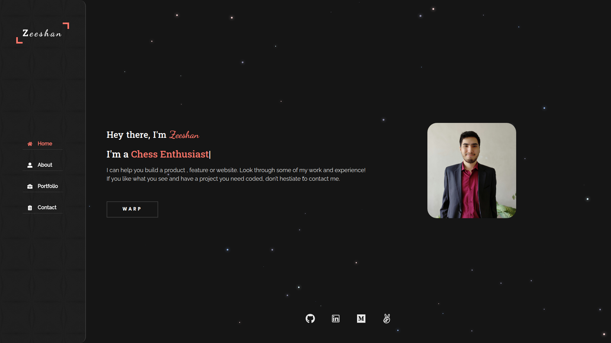

<!-- @format -->


# Portfolio

> My Peronal Portfolio created using React.
> 

## Deployment

You can find the app [live link here](https://portfolio-zhadier.netlify.app/)

## Built With

- Languages: _**JavaScript, HTML & SCSS**_
- Frameworks: _**React**_
- Technologies used: _**Visual Studio Code**_

## Getting Started

### To launch the project locally:

#### Step 1:

- Clone this repo locally using git in the command line and the following command

```bash
> git clone git@github.com:zhadier/portfolio.git
```

- Alternatively, you can just download the complete zip file and extract the folder in your directory

- Enter the portfolio folder using the following command and open it using a code editor of your choice.

```bash
> cd portfolio
```

#### Step 2:

- Download all dependencies to use the Project

```bash
> npm install
```

#### Step 3:

In the project directory, you can run:

##### `npm start`

Runs the app in the development mode.\

The page will reload when you make changes.\
You may also see any lint errors in the console.

##### `npm run build`

Builds the app for production to the `build` folder.\
It correctly bundles React in production mode and optimizes
the build for the best performance.

The build is minified and the filenames include the
hashes.\
Your app is ready to be deployed!

See the section about
[deployment](https://facebook.github.io/create-react-app/docs/deployment)
for more information.

## Author

👤 **Zeeshan Haider**

| Platform     | Badge                                                     |
| ------------ | --------------------------------------------------------- |
| **GitHub**   | [@zhadier](https://github.com/zhadier)                    |
| **LinkedIn** | [Zeeshan Haider](https://www.linkedin.com/in/zhadier39/)\ |

## Show your support

Give a ⭐️ if you like this project!
I would love to hear your thoughts and ideas 🖤

## Acknowledgments

- Thank you to all our peers who helped us out through this wonderful journey at Microverse. 🌥️

## 📝 License

This project is [MIT](./MIT.md) licensed.
